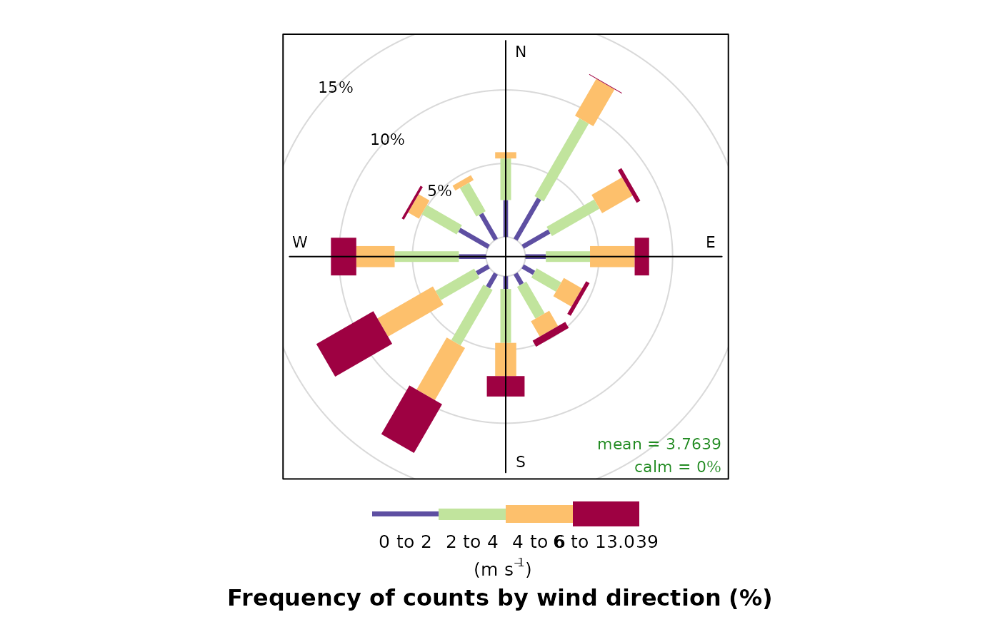

# Using {worldmet} to Locate, Import & Visualise Meteorological Data

``` r
library(worldmet)
```

## Importing Hourly Meteorological Data

### Show all sites

The function to use to find which sites are available is
[`import_ghcn_stations()`](https://openair-project.github.io/worldmet/reference/import_ghcn_stations.md).

``` r
import_ghcn_stations()
#> # A tibble: 34,181 × 11
#>    id    name  country state network   lat   lng elevation gsn_flag hcn_crn_flag
#>    <chr> <chr> <chr>   <chr> <chr>   <dbl> <dbl>     <dbl> <chr>    <chr>       
#>  1 AAI0… REIN… AA      NA    I        12.5 -70.0      18.3 NA       NA          
#>  2 ACL0… BARB… AC      TX    L        17.6 -61.8       5   NA       NA          
#>  3 ACM0… COOL… AC      NA    M        17.1 -61.8      10   NA       NA          
#>  4 ACU5… SOMB… AC      NA    U        18.6 -63.5      10   NA       NA          
#>  5 ACU5… SOMB… AC      NA    U        18.6 -63.5      12   NA       NA          
#>  6 ACU5… SOMB… AC      NA    U        18.6 -63.5      14   NA       NA          
#>  7 ACU5… SOMB… AC      NA    U        18.6 -63.5      16   NA       NA          
#>  8 ACU5… SOMB… AC      NA    U        18.6 -63.5       9   NA       NA          
#>  9 ACW0… ST J… AC      NA    W        17.1 -61.8      19.2 NA       NA          
#> 10 AEI0… ABU … AE      NA    I        24.4  54.7      26.8 NA       NA          
#> # ℹ 34,171 more rows
#> # ℹ 1 more variable: wmo_id <chr>
```

A better way to explore available stations is by using `return = "map"`,
which shows each station on an interactive map. Click to expand the
markers until you find the site of interest (shown by a blue marker),
which can then be clicked for further information. The most important
information revealed in the marker is the station ID, which is used to
access the data.

``` r
import_ghcn_stations(return = "map")
```

### Search based on latitude and longitude

Often, one has an idea of the region in which a site is of interest. For
example, if the interest was in sites close to London, the latitude and
longitude can be supplied and a search is carried out of the 10 nearest
sites to that location. There is also an option n that can be used in
change the number of nearest sites shown. If a lat/lng is provided,
clicking on the blue marker will show the approximate distance between
the site and the search coordinates.

``` r
import_ghcn_stations(lat = 51.5, lng = 0, return = "map")
```

### Importing Data

To obtain the data the user must supply a station ID and year(s) of
interest. For example, to download data for Heathrow Airport in 2024 (ID
`UKI0000EGLL`):

``` r
met_london <- import_ghcn_hourly("UKI0000EGLL", year = 2025)
head(met_london)
```

    #> # A tibble: 6 × 30
    #>   station_id  station_name date                  lat    lng  elev    wd    ws
    #>   <fct>       <fct>        <dttm>              <dbl>  <dbl> <dbl> <dbl> <dbl>
    #> 1 UKI0000EGLL HEATHROW     2025-01-01 00:00:00  51.5 -0.461  25.3  233.  11.1
    #> 2 UKI0000EGLL HEATHROW     2025-01-01 01:00:00  51.5 -0.461  25.3  227.  12.3
    #> 3 UKI0000EGLL HEATHROW     2025-01-01 02:00:00  51.5 -0.461  25.3  222.  12.1
    #> 4 UKI0000EGLL HEATHROW     2025-01-01 03:00:00  51.5 -0.461  25.3  220.  11.8
    #> 5 UKI0000EGLL HEATHROW     2025-01-01 04:00:00  51.5 -0.461  25.3  218.  12.0
    #> 6 UKI0000EGLL HEATHROW     2025-01-01 05:00:00  51.5 -0.461  25.3  218.  11.8
    #> # ℹ 22 more variables: air_temp <dbl>, atmos_pres <dbl>, visibility <dbl>,
    #> #   dew_point <dbl>, rh <dbl>, cl <dbl>, cl_baseht <dbl>, cl_1 <dbl>,
    #> #   cl_baseht_1 <dbl>, cl_2 <dbl>, cl_baseht_2 <dbl>, cl_3 <dbl>,
    #> #   cl_baseht_3 <dbl>, precip <dbl>, precip_03 <lgl>, precip_06 <dbl>,
    #> #   precip_09 <lgl>, precip_12 <dbl>, precip_15 <lgl>, precip_18 <lgl>,
    #> #   precip_21 <lgl>, precip_24 <dbl>

A wind rose (for example) can easily be plotted using `openair`:

``` r
# use function from openair
openair::windRose(met_london)
```



## Data Types

`worldmet` can access data from the newer Global Historic Climate
Network (GHCN) and the legacy Integrated Surface Database (ISD). The ISD
can be accessed using:

- [`import_isd_stations()`](https://openair-project.github.io/worldmet/reference/import_isd_stations.md)
  to obtain metadata, and

- [`import_isd_hourly()`](https://openair-project.github.io/worldmet/reference/import_isd_hourly.md)
  and
  [`import_isd_lite()`](https://openair-project.github.io/worldmet/reference/import_isd_lite.md)
  to obtain measurement data.

The GHCN contains other products outside of hourly data. Also available
in `worldmet` are:

- [`import_ghcn_daily()`](https://openair-project.github.io/worldmet/reference/import_ghcn_daily.md),
  which imports daily average data. Users may select specific stations,
  but all available years for that station will be downloaded.

- [`import_ghcn_monthly_temp()`](https://openair-project.github.io/worldmet/reference/import_ghcn_monthly.md),
  which imports monthly average temperatures for the entire GHCN.

- [`import_ghcn_monthly_prcp()`](https://openair-project.github.io/worldmet/reference/import_ghcn_monthly.md),
  which imports monthly total precipitation for specific stations.

## Parallel Processing

If you are importing a lot of meteorological data, this can take a long
while. This is because each combination of year and station (for hourly
data) requires downloading a separate data file from NOAA’s online data
directory, and the time each download takes can quickly add up. Many
functions in `worldmet` can use parallel processing to speed downloading
up, powered by the capable [mirai](https://mirai.r-lib.org) package. If
users have any [mirai](https://mirai.r-lib.org) “daemons” set, certain
files will be downloaded in parallel. The greatest benefits will be seen
if you spawn as many daemons as you have cores on your machine, although
one fewer than the available cores is often a good rule of thumb. Your
mileage may vary, however, and naturally spawning more daemons than
station-year combinations will lead to diminishing returns.

``` r
# set workers - once per session
mirai::daemons(4)

# import lots of data - NB: no change in import_ghcn_hourly()!
big_met <- import_ghcn_hourly(code = "UKI0000EGLL", year = 2010:2025)
```

The following functions support [mirai](https://mirai.r-lib.org)-powered
parallelism.

- [`import_ghcn_hourly()`](https://openair-project.github.io/worldmet/reference/import_ghcn_hourly.md)

- [`import_ghcn_daily()`](https://openair-project.github.io/worldmet/reference/import_ghcn_daily.md)

- [`import_ghcn_monthly_prcp()`](https://openair-project.github.io/worldmet/reference/import_ghcn_monthly.md)
  (but **not**
  [`import_ghcn_monthly_temp()`](https://openair-project.github.io/worldmet/reference/import_ghcn_monthly.md))

- [`import_isd_hourly()`](https://openair-project.github.io/worldmet/reference/import_isd_hourly.md)

- [`import_isd_lite()`](https://openair-project.github.io/worldmet/reference/import_isd_lite.md)

> Historically, parallelism in
> [worldmet](https://openair-project.github.io/worldmet/) was achieved
> with [doParallel](https://github.com/RevolutionAnalytics/doparallel),
> [foreach](https://github.com/RevolutionAnalytics/foreach) and
> `{parallel}` and was activated using the `n.cores` argument of the
> legacy
> [`importNOAA()`](https://openair-project.github.io/worldmet/reference/deprecated-isd.md)
> function. While this will still work, it is recommended users set
> their own daemons before using
> [`importNOAA()`](https://openair-project.github.io/worldmet/reference/deprecated-isd.md).
> This should avoid any issues with mistakenly spawning too many
> daemons, or accidentally spawning daemons within other daemons.
